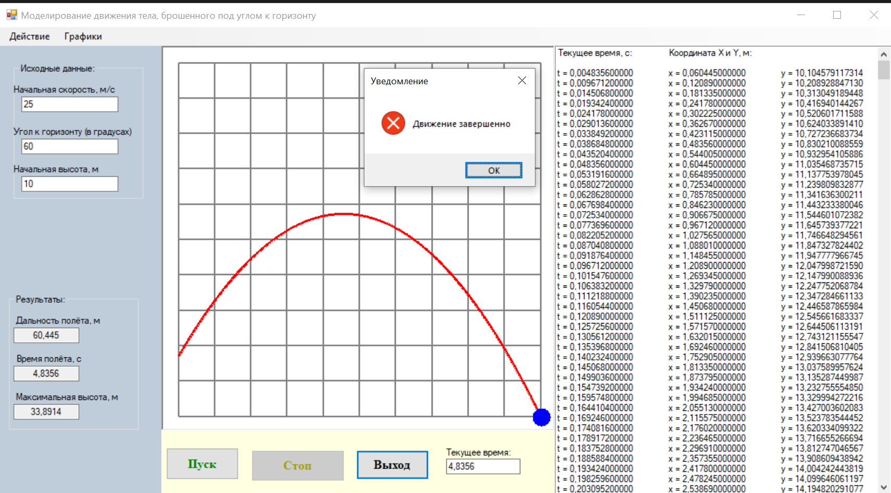
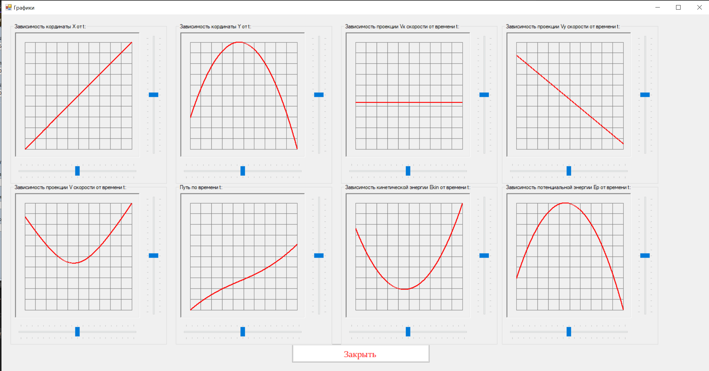

# gravity-flight

RU: 
Моделирование движения тела, брошенного под углом к горизонту (Windows Forms, C#).
Модель была разработана мной в 2022 году
Приложение рассчитывает траекторию полёта, показывает анимацию движения, выводит основные результаты (дальность, время полёта, максимальную высоту) и строит набор графиков зависимостей от времени.

## Скриншоты

1) Интерфейс приложения (ввод данных / основное окно): 

2) Программа после выполнения (результаты / траектория / графики):

## Возможности

### Главная форма
Ввод исходных данных:
	начальная скорость `v0` (м/с)
	угол к горизонту `α` (градусы)
	начальная высота `h0` (м)
Вывод результатов:
	дальность полёта `L` (м)
	время полёта `T` (с)
	максимальная высота `H` (м)
	Анимация движения по траектории
	Масштабирование траектории колесом мыши

### Окно “Графики”
Построение 8 графиков:
1. `x(t)` — координата по X
2. `y(t)` — координата по Y
3. `Vx(t)` — проекция скорости по X
4. `Vy(t)` — проекция скорости по Y
5. `V(t)` — модуль скорости
6. `S(t)` — путь
7. `Ekin(t)` — кинетическая энергия (на единицу массы)
8. `Ep(t)` — потенциальная энергия (на единицу массы)

Для каждого графика:
	масштабирование ползунками (по осям)
	зум колесом мыши
	возможность скрыть/показать отдельный график

## Используемая физическая модель

Сопротивление воздуха не учитывается. Ускорение свободного падения:
`g = 9.81 м/с²`

Компоненты скорости:
`Vx = v0 * cos(α)`
`Vy(t) = v0 * sin(α) - g*t`

Координаты:
`x(t) = v0 * cos(α) * t`
`y(t) = h0 + v0 * sin(α) * t - (g * t²)/2`

Время полёта находится из условия `y(T) = 0`.

## Как запустить

### Требования
- Windows
- Visual Studio 2022 (или совместимая версия)
- .NET Framework (как в проекте/решении)

### Запуск
1. Клонировать репозиторий:
   git clone <repo_url>

2. Открыть gravity-flight.sln в Visual Studio

3. Build → Rebuild Solution

4. Запустить (F5)

5. Поменять начальные значения начальной скорости, угла к горизонту, начальной высоты на необходимые

6. Кнопка "Пуск"

ENG:
Projectile motion simulation (launched at an angle to the horizon) using Windows Forms (C#).
The model was developed by me in 2022.

The application calculates the flight trajectory, shows an animation of the motion, displays key results (range, flight time, maximum height), and plots a set of time-dependent graphs.

Screenshots

1) Application UI (input / main window):

2) After running the simulation (results / trajectory / graphs):

### Features

### Main window
Input parameters:
	initial speed v0 (m/s)
	launch angle α (degrees)
	initial height h0 (m)

Computed results:
	range L (m)
	flight time T (s)
	maximum height H (m)

Additional:
	animated motion along the trajectory
	zooming the trajectory with the mouse wheel

### “Charts” window
8 time-dependent plots:
	x(t) — X coordinate
	y(t) — Y coordinate
	Vx(t) — X component of velocity
	Vy(t) — Y component of velocity
	V(t) — speed magnitude
	S(t) — path length
	Ekin(t) — kinetic energy (per unit mass)
	Ep(t) — potential energy (per unit mass)
	
For each chart:
-scaling with sliders (both axes)
-mouse-wheel zoom
-hide/show individual charts

###Physics model
Air resistance is neglected. Gravitational acceleration:
	g = 9.81 m/s²

Velocity components:	
	Vx = v0 * cos(α)
	Vy(t) = v0 * sin(α) - g*t

Coordinates:
x(t) = v0 * cos(α) * t
y(t) = h0 + v0 * sin(α) * t - (g * t²)/2

The flight time is obtained from the condition y(T) = 0.

### How to run
### Requirements
	1) Visual Studio 2022 (or compatible)
	2).NET Framework (as specified by the project/solution)

### Steps
1)Clone the repository:  git clone <repo_url>
2)Open gravity-flight.sln in Visual Studio.
3)Build → Rebuild Solution.
4)Run (F5).
5)Set the required values of initial speed, launch angle, and initial height.
6)Click “Start”.